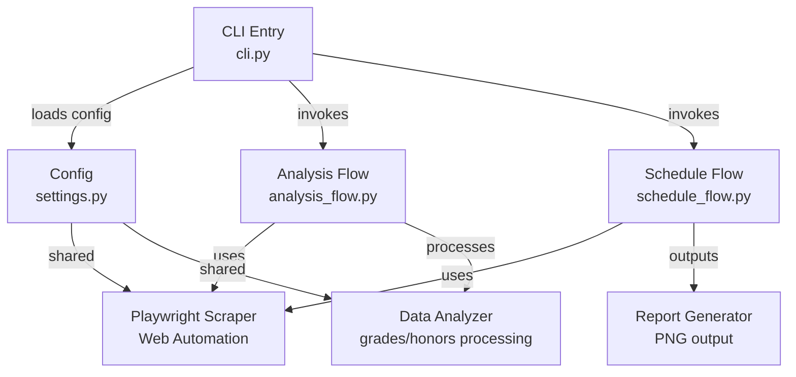

# Grades Checker (FEU Tech SOLAR)

Tooling for FEU Tech SOLAR scraping and analysis:

- grades/honors analysis
- schedule availability checker
- PNG schedule report generation
- optional professor mapping from Excel

## Quick Start

```bash
pip install -r requirements.txt
playwright install chromium
```

```bash
grades-checker --live
schedule-checker --group-size 3 --image-output src/.cache/schedule_report.png
```

## Docs

See the docs folder:

- [docs/index.md](docs/index.md)
- [docs/getting-started.md](docs/getting-started.md)
- [docs/schedule-checker.md](docs/schedule-checker.md)
- [docs/professor-excel.md](docs/professor-excel.md)
- [docs/configuration.md](docs/configuration.md)

## Architecture (UML)



## Tech Stack

- **Python 3.10+**: Core language
- **Playwright**: Web scraping & automation
- **Rich**: CLI output formatting
- **Pillow**: Image processing
- **openpyxl**: Excel parsing
